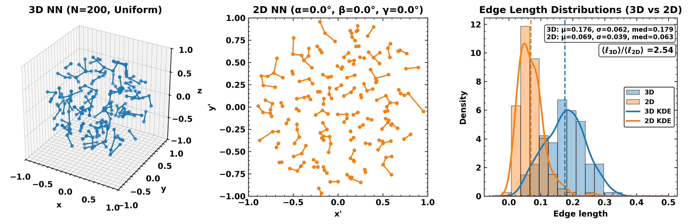

# Core Spacing 3D

Core Spacing 3D is a research codebase for quantifying projection bias in
nearest-neighbour (NN) and minimum spanning tree (MST) spacings of dense cores.
It provides Monte Carlo experiments on spherical and fractal toy models,
plotting utilities, and a public correction helper based on the Barnes et al.
2026 fit.



> Note: This code is under active development. Please report any issues you find.

## Projection correction (Barnes et al. 2026)

Returns fitted parameters in form:

$$C(N, SDR) = C_\infty [1 - \exp(-SDR / S_0)] (N / N_0)^\beta.$$

Fitting this form to the grid of ensemble-averaged measurements from
1000 fractal realisations with $D=1.7-2.5$, $n_{\mathrm{div}}=2-4$ yields:

$$\mathcal{C}_\infty = 1.94 \pm 0.01,$$
$$S_0      = 21.8 \pm 0.3,$$
$$\beta    = 0.173 \pm 0.003.$$

The packaged values are used by default in the `projection_correction` helper.

## Project structure

- `config/` - Configuration files
- `data/` - Data directories
  - `core/` - Core data files
  - `products/` - Processed outputs (fit parameters, tables)
  - `scratch/` - Temporary files
- `env/` - Environment setup (requirements, virtualenv)
- `figures/` - Output figures and plots
- `manuscripts/` - Project manuscripts
- `notebooks/` - Jupyter notebooks
  - `projection_correction_example.ipynb` - Usage walkthrough for projection correction
  - `nn_ashes.ipynb` - Nearest Neighbour spacing in Ashes observations
  - `nn_3d_vs_2d.ipynb` - Baseline NN/MST 3D vs 2D experiments
  - `nn_3d_vs_2d_N.ipynb` - NN 3D vs 2D varying N (number of points)
  - `nn_3d_vs_2d_SDR.ipynb` - NN 3D vs 2D varying SDR (spatial dynamic range)
  - `nn_3d_vs_2d_N_SDR.ipynb` - NN 3D vs 2D varying N and SDR (fitting C(N, SDR))
  - `mst_3d_vs_2d.ipynb` - Baseline MST (minimum spanning tree) 3D vs 2D experiments
- `pipelines/` - Optional workflows
- `presentations/` - Project presentations
- `src/corespaceing3d/` - Python package
  - `core/` - I/O and configuration utilities
  - `plotting/` - Figure and visualization helpers
  - `tasks/` - Reproducible analysis tasks
  - `utils/` - Core algorithms and helpers
- `tables/` - Output tables

## Setup

```bash
# create and activate virtual environment
python -m venv .venv
source .venv/bin/activate

# install dependencies
pip install -r env/requirements.txt
pip install -e .
```

## Quickstart

- Start with the baseline NN/MST examples in `notebooks/nn_3d_vs_2d.ipynb`.
- The projection-correction fit is developed in
  `notebooks/nn_3d_vs_2d_N_SDR.ipynb`.
- A usage walkthrough is in `notebooks/projection_correction_example.ipynb`.

Example usage:

```python
from corespaceing3d import projection_correction

# compute 2D measurement correction factor C for (number of points) N=100 points and (spatial dynamic range) SDR=50
C = projection_correction(N=100, SDR=50)

# apply correction to a projected measurement
mean_nn_2d = 0.1 # example 2D mean nearest-neighbour spacing
mean_nn_3d = projection_correction(N=100, SDR=50, apply_to=mean_nn_2d)

# to produce your own 3D profile and project that in 2D
out = main(
    N_POINTS=100, # number of points
    RADIUS=1, # sphere radius
    SEED=1, # random seed
    profile="uniform", # point distribution profile
    ALPHA_DEG=0, # rotation angles in degrees
    BETA_DEG=10, # rotation angles in degrees
    GAMMA_DEG=20, # rotation angles in degrees
    verbose=True, # print stats during processing
)

# Unpack output
pts3d_rot = out["pts3d_rot"] # rotated 3D points
pts2d     = out["pts2d"] # projected 2D points
edges3d   = out["edges3d"] # 3D NN edges
edges2d   = out["edges2d"] # 2D NN edges
len3      = out["len3"] # 3D NN length
len2      = out["len2"] # 2D NN length
```

## Citation

If you use this code in your research, please cite:

Barnes, A. T., et al. (2026).

This project was produced using the
[cookiecutter-research-project](https://github.com/jdhenshaw/cookiecutter-research-project) template.

This project is licensed under the MIT License - see the [LICENSE](LICENSE)
file for details.

---
